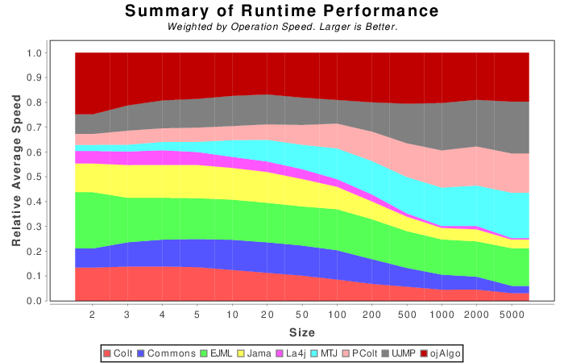

# Online TF-IDF in SpringBoot / Java 11
**Table of content**

[1.1 What TF-IDF is all about?](#11-what-tf-idf-is-all-about)  
[1.1.1 An essential tool for search engines](#111-an-essential-tool-for-search-engines)  
[1.1.2 Lucene, Elastic search and SolR](#112-lucene-elastic-search-and-solr)  
[1.1.3 TF equation](#113-tf-equation)  
[1.1.4 IDF equation](#114-idf-equation)  
[1.1.5 Document vector equation](#115-document-vector-equation)  
[1.1.6 Cosine similarity](#116-cosine-similarity)  
[1.1.7 Weak theoretical background](#117-weak-theoretical-background)  
  
  
[2 This project](#2-this-project)  
[2.1 Online learning](#21-online-learning)  
[2.2 Tokenizer](#22-tokenizer)  
[2.3 Database](#23-database)  
[2.3.1 Vector space state](#231-vector-space-state)  
[2.3.2 Spring Repostiory](#232-spring-repostiory)  
[2.3.3 Concurrent updates](#233-concurrent-updates)  
[2.3.4 H2 database console](#234-h2-database-console)  
  
  
[2.4 Sparse vectors library](#24-sparse-vectors-library)  
[2.5 Output](#25-output)  


## 1.1 What TF-IDF is all about?

### 1.1.1 An essential tool for search engines

**TF-IDF** comes from information retrieval (IR) community. It's a way to represent a document in what is called a vector space (This is part of the **Vector Space Models**, VSM). Each dimension correspond to a word (or term) that can be found in a document. A document is a vector starting from the origin of the space and ending to the TF-IDF coordinates. When you query a search engine, what you type is converted in such vector. The final step is to found document vectors that **point to the same direction** than your query vector. The **[cosine similarity](https://en.wikipedia.org/wiki/Cosine_similarity)** is used for that. It's all about angles.

### 1.1.2 Lucene, Elastic search and SolR

TF-IDF and Cosine similarity is at the heart of Apache lucene search engine. Two famous search engines are build on top of it:

- **Elasticsearch** is used by Netflix, Tinder, Stackoverflow, Linkedin, Medium
- **Apache SoIR** is used by Adobe, eBay, Netflix, Instagram

### 1.1.3 TF equation

For a given document **d**, containing **N** terms, we define the term frequency as:


It's just a normalized count of a term in a document. TF is in the range [0,1].

### 1.1.4 IDF equation

For a given corpus of **N** documents, we define the inverse document frequency as:


Where `DocCount(term)` is simply how many documents contains the term.

### 1.1.5 Document vector equation

For a vector space with **M** dimensions (or terms), we define the vector of a document **d** as:


As you can see, the IDF act as a weight over all TF coordinates. 

- If the term is rare, its IDF is high
- If the term is not in the document, the TF is 0

### 1.1.6 Cosine similarity

Given two documents vector D1 and D2, we define the cosine similarity as:


It is basically the cosine of the angle between the two vectors. It is theoretically in the range [-1,1], but in our context it is in the range [0,1]

- A similarity of 0 mean the two documents are completely **uncorrelated**, their vector are orthogonal
- A similarity of 1 mean the two documents are mostly identical

See [wikipedia](https://en.wikipedia.org/wiki/Cosine_similarity) for more information.

### 1.1.7 Weak theoretical background

The IR community have struggled for years to found a strong mathematical justification of TF-IDF. See [IR Models: Foundations and Relationships](http://www.eecs.qmul.ac.uk/~thor/2012/2012-SIGIR-Tutorial-IR-Models-Foundations-Relationships.pdf) by Thomas Roelleke for a global overview. On the other side of the spectrum, you have Michael I. Jordan (multi awarded AI researcher identified as the "most influential computer scientist" in 2016) considering it as a **thorough muddle** from a statistical point of view. You can listen to him [here](https://youtu.be/fBNsHPtTAGs?t=429). He worked a lot on probabilistic modeling of documents, especially on Latent Dirichlet Allocation (LDA). See [this paper](https://www.jmlr.org/papers/volume3/blei03a/blei03a.pdf) of instance. For Jordan, the main issue of the IR community is that they have no idea about **the De finetti theorem and exchangeability**. It's a typical Bayesian perspective whereas TF-IDF is a frequentist perspective.

*It is important to emphasize that an assumption of exchangeability is not equivalent to an assumption that the random variables are independent and identically distributed.  Rather, exchangeability essentially can be interpreted as meaning "conditionally independent and identically distributed", where the conditioning is with respect to an underlying latent parameter of a probability distribution.   Conditionally, the joint distribution of the random variables is simple and factored while marginally over the latent parameter, the joint distribution can be quite complex. Thus, while an assumption of exchangeability is clearly a major simplifying assumption in the domain of text modeling, and its principal justification is that it leads to methods that are computationally efficient, the exchangeability assumptions do not necessarily lead to methods that are restricted to simple frequency counts or linear operations. We aim to demonstrate in the current paper that, by taking the de Finetti theorem seriously, we can capture significant intra-document statistical structure via the mixing distribution.*


So basically, TF-IDF is just an heuristic, simple to compute, which have made the success of a lot of companies. More powerful and accurate techniques (based on Bayesian probabilities) exists but they are far more complex to compute.

# 2 This project

## 2.1 Online learning

This little project demonstrate how to compute TF-IDF on the fly. 

- We receive a JSON document from HTTP, the GUI is running on [http://localhost:8080/](http://localhost:8080/)
- The document is tokenized
- The state of the vector space is updated (The state is persisted in a H2 database)
- Using this state, we can compute the correlation between various documents (or all of them)

The problem:

- If a new word is found in the incoming document, a new dimension must be added to the vector space. Unfortunately it means that all documents vectors must be re-computed. They will have one more coordinate. So **both TF and IDF terms change**.
- If no new word is found in the incoming document, the document count is still increased by one. So **only the IDF term change**. This also mean all documents vectors must be updated.
- Vector Space Models (VSM) are victim of the [curse of dimensionality](https://en.wikipedia.org/wiki/Curse_of_dimensionality). This mean a document contains only a small amount of word. Their vector contains a lot of 0. Because of this sparsity, it is really easy to waste a large amount of memory if you don't pay attention to it. If you want to scale, you must choose a good representation for your data.

## 2.2 Tokenizer

Our tokenizer is way too simple, but it will be just enough for the demo.

```java
public Stream<String> tokenize(String content) {
		content = content.replaceAll("[”“’•—…|@$\\/#°\\-:&*+=\\[\\]?!(){},''\\\">_<;%\\\\.]", " ");
		return Arrays.asList(content.split("\\s"))
				.stream()
				.filter(Predicate.not(String::isEmpty))
				.map(w -> w.toLowerCase());
	}
```

## 2.3 Database

### 2.3.1 Vector space state

We store the state of the vector space with 3 simple tables DOCUMENT,WORD and COUNTER:

```sql
CREATE TABLE IF NOT EXISTS DOCUMENT  (
	  id INT AUTO_INCREMENT  PRIMARY KEY,
	  name VARCHAR(250) NOT NULL
	);

CREATE TABLE IF NOT EXISTS WORD  (
	  id INT AUTO_INCREMENT  PRIMARY KEY,
	  name VARCHAR(250) NOT NULL
	);
	
CREATE TABLE IF NOT EXISTS COUNTER  (
	  docId INT NOT NULL,
	  wordId INT NOT NULL,
	  count INT NOT NULL,
	  primary key (docId,wordId),
	  foreign key (docId) references DOCUMENT(ID),
	  foreign key (wordId) references WORD(ID)
	);
```

The table **COUNTER** handle the sparsity of the data. It only contains the vector coordinates that are not 0 (note that it's not TF-IDF yet at this point).

The foreign key **wordId** directly match the index of a coordinate in the vector.

### 2.3.2 Spring Repostiory

The class `StateManager` is the Spring repository updating the tables using `JdbcTemplate`. 

- There is no point to use an ORM here.
- We don't use parametrized queries for simplicity (there is no SQL injection risk here).

We tried to compute the tf-idf without collecting all the data in memory. This is why we used the method `JdbcTemplate::query` that return `void` instead of a list of records.

### 2.3.3 Concurrent updates

We want to insert a record in a table only if it is not in there, in one shot. This is important if we plan to scan multiple documents in parallel. We do that with **MERGE INTO**. 

Here is an example for the table WORD:

```sql
MERGE INTO WORD AS W 
USING (SELECT 'hello' NEWNAME) AS S 
ON W.NAME=S.NEWNAME 
WHEN NOT MATCHED THEN 
INSERT (NAME) VALUES('hello')
```

Things are similar when we want to update the counter of a term (id 12) for a given document (id 143) in table COUNTER:

```sql
MERGE INTO COUNTER AS W 
USING (SELECT 143 NEWDOCID, 12 NEWWORDID) AS S 
ON (W.DOCID=S.NEWDOCID AND W.WORDID=S.NEWWORDID) 
WHEN NOT MATCHED THEN 
	INSERT (DOCID,WORDID,COUNT) VALUES (S.NEWDOCID,S.NEWWORDID,1) 
WHEN MATCHED THEN 
	UPDATE SET COUNT = COUNT+1
```

### 2.3.4 H2 database console

The H2 console is enable in `src/main/resources/application.properties`

```ini
url: http://localhost:8080/h2-console
login: sa
password: password
jdbc url: jdbc:h2:file:./data/tfidf
```

## 2.4 Sparse vectors library

There is a lot of API to do vectors and matrices calculations in Java. You can go [here](https://java-matrix.org/) and [there](http://lessthanoptimal.github.io/Java-Matrix-Benchmark/). I tested ojAlgo and Mtj. [Mtj](https://github.com/fommil/matrix-toolkits-java) is really great to handle sparse matrices  whereas with [ojAlgo](https://www.ojalgo.org/) I had an outOfMemory error. My use case was 41157  vectors with 20127 dimensions.



Using Mtj, you can create a sparse vector very easily like this:

```java
SparseVector documentVector = new SparseVector(100); // create a vector with 100 dimentions
documentVector.set(14,tfidf); // set the coordinate 14 (from 0 to 99) with the tfidf value
```

Computing the document vector looks like this:

```java
// get the number of vectors in the vector space
Long documentCount = jdbcTemplate.queryForObject("SELECT count(*) from DOCUMENT", Long.class);
// get the size of the vector space (how many dimensions)
// we prefer MAX(ID) in case we remove elements for whatever reason
// in this way the ID of a word is always a valid index in the vector
Long wordCount = jdbcTemplate.queryForObject("SELECT count(*) from WORD", Long.class); // risky
Long wordCount = jdbcTemplate.queryForObject("SELECT MAX(ID) from WORD", Long.class); // robust

// for a given document with id docId, we compute its vector
SparseVector documentVector = new SparseVector(wordCount.intValue());
// this query return how many words are used in the document
Double docSize = jdbcTemplate.queryForObject("SELECT SUM(COUNT) FROM COUNTER WHERE DOCID="+docId, Double.class);
// this query found all words in the document with their count
jdbcTemplate.query("SELECT WORDID, SUM(COUNT) FROM COUNTER WHERE DOCID="+docId+" GROUP BY WORDID",rs->{
    Long wordId = rs.getLong(1);
    Double normalizedTermFrequency = rs.getDouble(2)/docSize;
    Double idf = computeIDF(wordId, documentCount);
    int sparseVectorIndex = wordId.intValue()-1;
    documentVector.set(sparseVectorIndex, normalizedTermFrequency * idf);
});
```
Here how we compute the IDF:

```java
private Double computeIDF(Long wordId, Long documentCount) {
	Long documentsWithThisWordCount = jdbcTemplate
			.queryForObject("SELECT count(*) from COUNTER WHERE WORDID = " + wordId, Long.class);
	Double idf = 1 + Math.log(documentCount.doubleValue() / documentsWithThisWordCount.doubleValue());
	return idf;
}
```
Finally computing the cosine similarity is straightforward:

```java
private Double computeSimilarity(Document d1,Document d2)
{
	Double norm1 = d1.getVector().norm(Vector.Norm.Two);
	Double norm2 = d2.getVector().norm(Vector.Norm.Two);
	Double denom = norm1 * norm2;
	double cosineSimilarity = denom == 0 ? 0 : d1.getVector().dot(d2.getVector()) / denom;
	return cosineSimilarity;
}
```
## 2.5 Output

Each time you add a new document, we log all the siblings for all documents with their similarity score. If a new word is detected it will be logged.

TODO: make a bot to feed the service with tons of documents.

